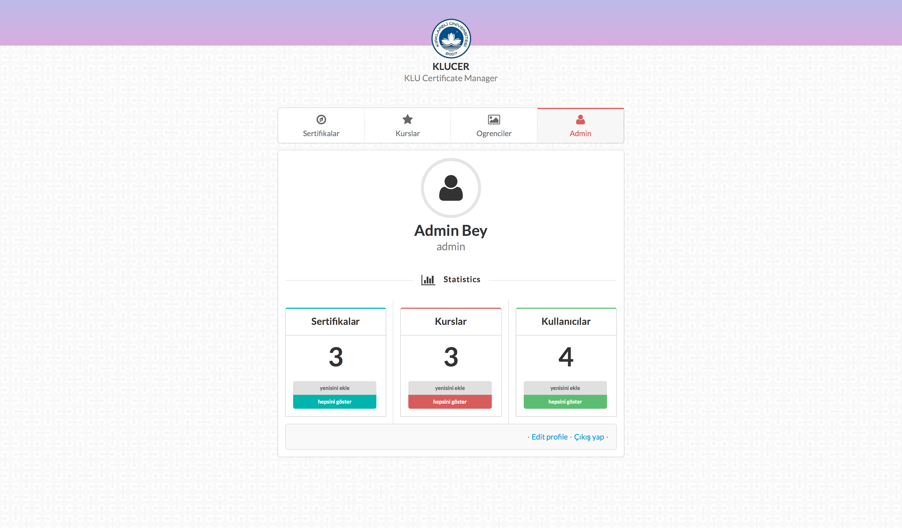

### KLU Certificate Manager App



Veritabanından öğrenci bilgisini çekerek otomatik sertifika oluşturma proğramı. Bunun için 3 kolay adımı takip ediyoruz:

1. Herhangi bir PDF oluşturma programı ile PDF şablonu oluşturuyoruz ve siteye yüklüyoruz
2. Sitede bulunan araç ile alanları belirliyoruz
3. Oluşturduğumuz kursla ilişkilendiriyoruz

##### Demo sürümü

[Byethost](http://certificate.byethost5.com) - [Youtube](https://www.youtube.com/watch?v=Z7se1D1R0s4)
* __Admin:__ _admin:foobar_
* __Öğrenci:__ _321:111_


#### Genel bakış

* Kullanıcı giriş sayfası
* Sertifikalar
* Kurslar
* Öğrenciler
* Kullanıcı profil
* Sertifika doğrulama

#### Veritaban Yapısı


#### Eklentiler

| Adı                              | Website               | Açıklama                               |
|:---------------------------------|:----------------------|:---------------------------------------|
| tecnick.com/tcpdf                | [TCPDF]               | PHP ile PDF oluşturma düzenleme        |
| setasign/fpdi                    | [FDPI]                | Var olan PDF dosyasını açma değiştirme |
| maatwebsite/excel                | [Laravel Excel]       | Excel dosyasını içe aktarma            |
| efficiently/authority-controller | [AuthorityController] | Kullanıcı yetki kontrolü               |
| ircmaxell/random-lib             | [RandomLib]           | Random sayı oluşturma                  |

[TCPDF]: http://www.tcpdf.org/
[FDPI]: http://www.setasign.com/products/fpdi/about/
[Laravel Excel]: http://www.maatwebsite.nl/laravel-excel/docs
[AuthorityController]: https://github.com/efficiently/authority-controller
[RandomLib]: https://github.com/ircmaxell/RandomLib


#### GENEL BAKIŞ

Sertifika proğramı, 

#### Kullanıcı giriş sayfası

* __CSS:__ `/app/public/css/login.css`
* __TEMPLATE:__ 
    * Ana: `/app/resources/views/login.blade.php`
        * Kimlik doğrulama: `/app/resources/views/partials/dogrulama.blade.php`
        * Son kurslar: `/app/resources/views/partials/sonkurslar.blade.php`
    * Giriş: `/app/resources/views/auth/login.blade.php`
    * Üye olma: `/app/resources/views/auth/register.blade.php`
    * Şifre sıfırlama: `/app/resources/views/auth/reset.blade.php`
    * Şifremi unuttum: `/app/resources/views/auth/password.blade.php`
* __CONTROLLER:__ Kullanıcı yönetimi Laravel ile beraber gelmekte, biz sadece bazı değişiklikler yapıyoruz. Mesela, email girişi yerine öğrenci numarayla giriş yapmak gibi.
    * `/app/Http/Controller/Auth/AuthController.php`
    * `/app/Http/Controller/Auth/PasswordController.php`

##### Son görüntülenen kursları değiştirmek

Görüntülenen son 3 kursumuz bir _action_'a değilde bir ana _template_ bağlı olduğundan, diğerleri gibi _Controllers_ klasında değilde _Providers_ klasında bulunmakta. Bu _template_ nerede kullanılırsa kullanılsın, ordan verilerimize ulaşabileceğiz. Öbür şekilde, her sayfa için ayrı ayrı belirleyecektik. [Laracasts](https://laracasts.com/series/laravel-5-fundamentals)

`/app/Http/Providers/AppServiceProvider.php`

__login.blade.php__ _template_'mızda __$courses__ değişkenine erişebileceğiz.

```php
public function boot()
{
    view()->composer('login', function($view) {
        $view->with('courses', \App\Course::orderBy('created_at', 'desc')->limit(3)->get());
    });
}
```

`/app/resources/views/login.blade.php`

```blade
@foreach($courses as $course)
    <h1>{ $course->title }</h1>
@endforeach
```

[](https://travis-ci.org/laravel/framework)
[](https://packagist.org/packages/laravel/framework)
[](https://packagist.org/packages/laravel/framework)
[](https://packagist.org/packages/laravel/framework)
[](https://packagist.org/packages/laravel/framework)