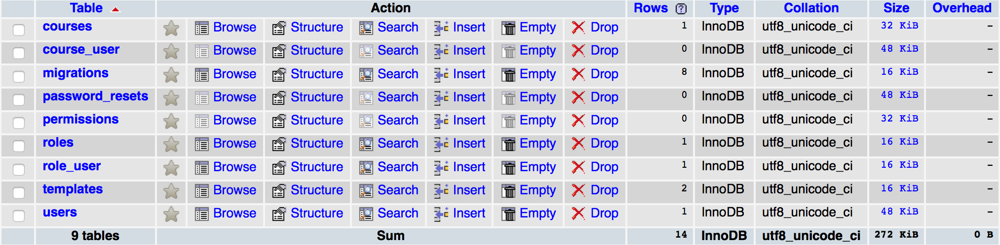

### KLU Certificate Manager App

--


Veritabanından öğrenci bilgisini çekerek otomatik sertifika oluşturma proğramı. Bunun için 3 kolay adımı takip ediyoruz:

1. Herhangi bir PDF oluşturma programı ile PDF şablonu oluşturuyoruz ve siteye yüklüyoruz
2. Sitede bulunan araç ile alanları belirliyoruz
3. Oluşturduğumuz kursla ilişkilendiriyoruz

--- 

#### Demo sürümü

* [Youtube](https://www.youtube.com/watch?v=Z7se1D1R0s4)
* [Website](http://certificate.byethost5.com) 
    * __Admin:__ _admin:foobar_ 
    * __Öğrenci:__ _321:111_

#### Genel bakış

* Başlanğıç ayarları
* Kullanıcı giriş sayfası
    * Son görüntülenen kursları değiştirmek 
    * Öğrenci numarası ile giriş
    * Başarılı girişte yönlendirme
* Sertifikalar
* Kurslar
* Öğrenciler
* Kullanıcı profil
* Sertifika doğrulama

#### Veritaban Yapısı



#### Eklentiler

| Adı                              | Website               | Açıklama                               |
|:---------------------------------|:----------------------|:---------------------------------------|
| tecnick.com/tcpdf                | [TCPDF]               | PHP ile PDF oluşturma düzenleme        |
| setasign/fpdi                    | [FDPI]                | Var olan PDF dosyasını açma değiştirme |
| maatwebsite/excel                | [Laravel Excel]       | Excel dosyasını içe aktarma            |
| efficiently/authority-controller | [AuthorityController] | Kullanıcı yetki kontrolü               |
| ircmaxell/random-lib             | [RandomLib]           | Random sayı oluşturma                  |

[TCPDF]: http://www.tcpdf.org/
[FDPI]: http://www.setasign.com/products/fpdi/about/
[Laravel Excel]: http://www.maatwebsite.nl/laravel-excel/docs
[AuthorityController]: https://github.com/efficiently/authority-controller
[RandomLib]: https://github.com/ircmaxell/RandomLib

-----

#### GENEL BAKIŞ

Sertifika proğramında kullandığımız ana terminler:

* __Award:__ Bu kurs ile kullanıcı arasında ilişki kurmayı sağlayan yardımcı olarak kullanılır. Veritabanında _course_user_ olarak kaydedilmiştir. Bir kullanıcın aldığı sertifikaları bunun yardımıyla sorgulayabiliriz.

* __Course:__ Kurslardır, proğramımızda herşey kursların etrafında döner. Kurs hakkında bilgilerin tutulduğu yer, veritabanında _courses_. Ayrıca Kurs-Şablon, Kurs-Kullanıcı ilişkileri burda belirlenir.

* __Template:__ Bu oluşturmuş olduğumuz hazır PDF şablon bilgilerinin tutulduğu yer. Veritabanında: _templates_

* __User:__ Kullanıcı bilgileri. Veritabanında: _users_

-----

#### BAŞLANGIÇ AYARLAR

Program dosyaları sunucuya atıldıktan sonra ilk önce PHPMYADMIN panelini kullanarak `veritabani.sql` dosyası içe aktarılır veya Laravelin sunmuş olduğu `php artisan migrate` ve sonrasında `php artisan db:seed` komutları ile veritabanında tablolar oluşturulur ve başlangıç bilgiler girilir. Sonrasında `.env` dosyasında bulunan değerler, kendi çevremize göre değiştirilir. 

```ShellSession
DB_HOST=localhost:8889
DB_DATABASE=awards
DB_USERNAME=root
DB_PASSWORD=root
```

Bağlanamadığımız takdirde ve hatanın neden kaynaklandığını bilmiyorsak, aynı dosyada `APP_ENV=production` satırı `APP_ENV=local` olarak değiştirip hatayı daha detaylı bir şekilde görebiliriz.

Bunun dışında ekstra ayarlar: `config/app.php` ve `config/database.php` dosyalarında bulunabilir.

--

#### Kullanıcı giriş sayfası

__TEMPLATE:__ HTML dosyaları diyebileceğimiz, __MVC__ deki __V__ görünüm ayarları dosyalarının saklandığı yer `/app/resources/views/`. Giriş sayfasına ait görüntüleri değiştirmek için

* Ana: `login.blade.php`
    * Kimlik doğrulama: `/partials/dogrulama.blade.php`
    * Son kurslar: `/partials/sonkurslar.blade.php`
* Giriş: `/auth/login.blade.php`
* Üye olma: `/auth/register.blade.php`
* Şifre sıfırlama: `/auth/reset.blade.php`
* Şifremi unuttum: `/auth/password.blade.php`

__CONTROLLER:__ Kullanıcı yönetimi Laravel ile beraber gelmekte, biz sadece bazı değişiklikler yapıyoruz. Mesela, email girişi yerine öğrenci numarayla giriş yapmak gibi.
* `/app/Http/Controller/Auth/AuthController.php`
* `/app/Http/Controller/Auth/PasswordController.php`

##### Son görüntülenen kursları değiştirmek

Görüntülenen son 3 kursumuz bir _action_'a değilde bir ana _template_ bağlı olduğundan, diğerleri gibi _Controllers_ klasında değilde _Providers_ klasında bulunmakta. Bu _template_ nerede kullanılırsa kullanılsın, ordan verilerimize ulaşabileceğiz. Öbür şekilde, her sayfa için ayrı ayrı belirleyecektik. [Laracasts](https://laracasts.com/series/laravel-5-fundamentals)

`/app/Http/Providers/AppServiceProvider.php`

__login.blade.php__ _template_'mızda __$courses__ değişkenine erişebileceğiz.

```php
public function boot()
{
    view()->composer('login', function($view) {
        $view->with('courses', \App\Course::orderBy('created_at', 'desc')->limit(3)->get());
    });
}
```

`/app/resources/views/login.blade.php`

```blade
@foreach($courses as $course)
    <h1>{ $course->title }</h1>
@endforeach
```

##### Öğrenci numarası ile giriş

Giriş yapmak için email yerine ögrenci numarası ile giriş yapmamızı sağlayan fonksiyon `/app/Http/Controllers/Auth/AuthController.php`

```php
public function postLogin(Request $request)
{
    $this->validate($request, [
        'ogrno' => 'required', 'password' => 'required',
    ]);
    ...
}
```

##### Başarılı girişte yönlendirme

Başarılı giriş yapıldığında istediğimiz sayfaya yönlendirme için `/app/Http/Controllers/Auth/AuthController.php` dosyasındaki `protected $redirectTo = 'istediğimiz_url';` değiştirilir. Çıkış yapıldığında ise tam altında bulunan `protected $redirectAfterLogout = 'istediğimiz_url';`

_____

#### EKLENTİLER 

#### TCPDF

__TCPDF__ eklentisi PDF oluşturma için kullanına en geniş ve çok amaçlı bir kütüphanedir. Bunun sayesinde PDF dosyamıza sade yazı, resim değilde barcode-qrcode gibi birçok şey daha ekleyebiliriz. Sitesinde yapılabileceğimiz eylemler genişçe örnekleri ile verilmiştir: http://www.tcpdf.org/examples.php. Qrcode oluşturma örneğine bakalım:

```php
// set style for qrcode
$style = array(
    'border' => true,
    'vpadding' => 'auto',
    'hpadding' => 'auto',
    'fgcolor' => array(0,0,0),
    'bgcolor' => false, //array(255,255,255)
    'module_width' => 1, // width of a single module in points
    'module_height' => 1 // height of a single module in points
);

// QR CODE
$pdf->write2DBarcode('www.tcpdf.org', 'QRCODE,Q', 20, 155, 30, 30, $style, 'N');
```

#### FPDI

__FPDI__ eklentisi önceden oluşturduğumuz PDF şablonlarını açıp, üstünde değişiklikler yapmamızı sağlamaktadır. Normalde bu eklenti [FPDF](http://www.fpdf.org/) geliştiricileri tarafından geliştirilmiştir, ama bizim kullanacağımız TCPDF ile de [bu köprünün](https://github.com/tecnickcom/TCPDF) yardımıyla sorunsuz çalıştırılabilmektedir. Burda bu eklentinin yardımı ile __A4__ boyutunda, __mm__ ile ölçünen, __Landscape__ (yatay) bir sayfa oluşturulur 

```php
$pdf = new \FPDI("L", "mm", "A4");
$pdf->SetPrintHeader(false);
$pdf->SetPrintFooter(false);
$pdf->AddPage();
```

ve aşağıdaki fonksiyon ile açmak istediğimiz dosya belirlenir.

```php
$pagecount = $pdf->setSourceFile('template.pdf');

$tpl = $pdf->importPage(1);

$pdf->useTemplate($tpl);
```

#### Laravel Excel

__Laravel Excel__ eklentisini Excel dosyaları içe aktarmamız için kullanırız. Diyelim ki, kullanıcıları önceden Excel dosyasında kaydettik, bunu

```php
$reader = Excel::load('/kullanicilar.xlsx')->get();

foreach ($reader as $sheet) {
    // Excell dosyasında her satır için yapılacak işlem
}
```

fonksiyonu ile okutabiliriz. Excel dosyasının ilk satırı sütün ismi olarak kullanılır ve o sütüne ait bilgiler `$sheet->ad` ile kullanıcın adına erişilir. Sonra `foreach` döngüsü içinde kullanıcı önceden kayıtlı olup olmadığı kontrol ettikten sonra 

```php
if (! \DB::select('select * from course_user where user_id='.$usr->id.' and course_id='.$courseId)) {
    $usr->courses()->attach($courseId, array('checkno' => $generator->generateString(11, '123456789')));
}
```

fonksiyonu ile Kurs-Kullanıcı ilişkisi kurulur. Burda `$generator->generateString(11, '123456789')` ile birden dokuza kadar olan sayılardan 11 haneli bir rastgele sayı oluşturulur.

#### AuthorityController

__AuthorityController__ eklentisini kullanıcı yetki kontrolü için kullanırız. Bir kullanıcın yetkisine göre hangi fonksiyonu çalıştırabileceğine, hangi sayfayı ziyaret edebileceğine yetki belirleme amaçlıdır. `/config/authority-contoller.php` dosyasını açtığımızda:

```php
$user = Auth::guest() ? new App\User : $authority->getCurrentUser();
if ($user->hasRole('admin')) {
    $authority->allow('manage', 'all');
} else {
    $authority->allow(['show', 'hepsi', 'check'], 'App\Award');
    $authority->allow(['profile', 'edit', 'update'], 'App\User');
}
```

Eğer kullanıcı __admin__ ise tüm yetkileri tanı, değilse sadece __Award__ klasına ait _show, hepsi, check_ ve __User__ klasına ait _profile, edit, update_ fonksiyonlarına izin verir. Template dosyalarımız içinde de sıkça rastladığımız `\Auth::user()->hasRole('admin')` komutu giriş yapan kullanıcın __admin__ yetkisi olup olmadığını kontrol etmektedir.

Veritabanında _roles_ yetkileri, _role_user_ hangi yetkinin hangi kullanıcıya verileceğini, _permissions_ izinleri belirler. Mesela, _roles_ tablosunda _editor_ adlı yetki oluşturup, belirli kullanıcılara sadece editlemeyi izin verebiliriz. 

#### RandomLib

__RandomLib__ eklentisini PHPnin varsayılan `random` fonksiyonu yerine kolayca rasgele sayı oluşturabilmemiz için kullanıyoruz. Eklentiyi programımıza dahil ettikten sonra:

```php
$factory = new RandomLib\Factory;
$generator = $factory->getMediumStrengthGenerator();
```

ile rasgele sayının hangi zorlukta oluşturulacağına dair algoritmasını belirliyoruz. Sonrasında

```php
$generator->generateString(32, 'abcdef')
```

yaptığımızda _adaeabecfbddcdaeedaedfbbcdccccfe_ gibi _abcdef_ harflerinden oluşan 32 haneli kelime elde ediyoruz.

[](https://travis-ci.org/laravel/framework)
[](https://packagist.org/packages/laravel/framework)
[](https://packagist.org/packages/laravel/framework)
[](https://packagist.org/packages/laravel/framework)
[](https://packagist.org/packages/laravel/framework)

--

[Laravel](http://laravel.com/) • [Laracasts](http://laracasts.com/) • [Kakajan SH](http://mervasdayi.tumblr.com/) • [Sayawan © 2015](http://sayawan.com/)